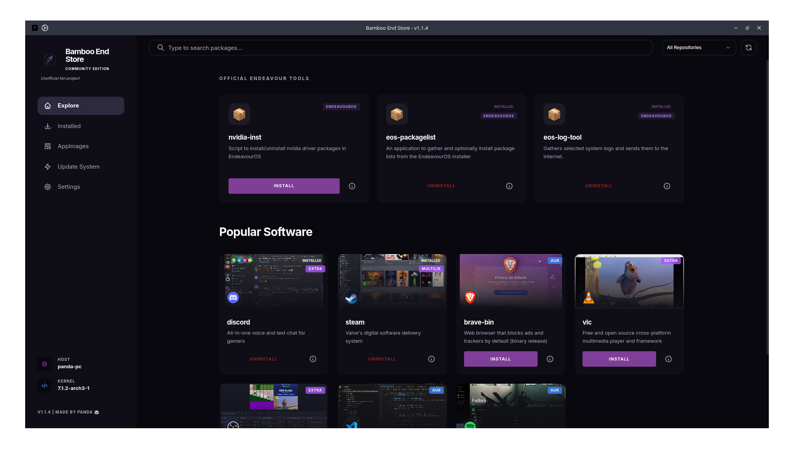
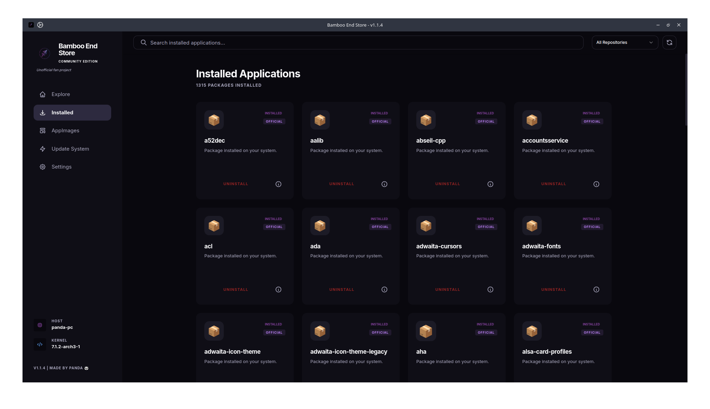
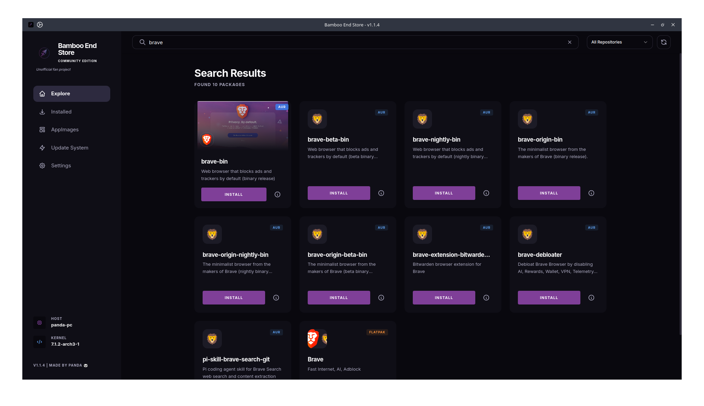
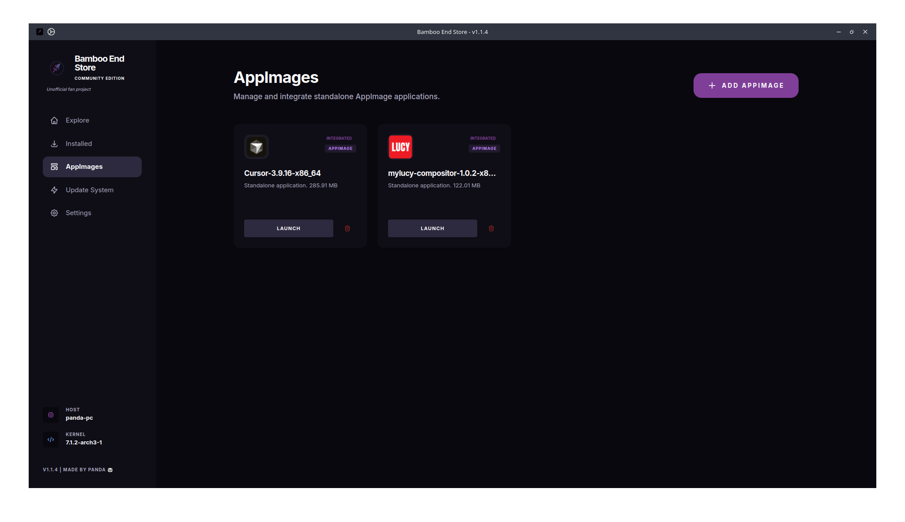
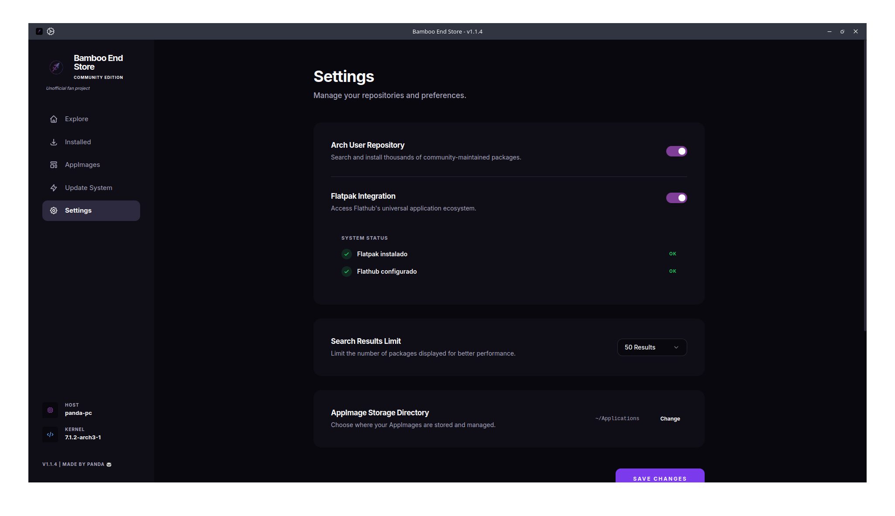

# 🐼 Bamboo End Store (Community Edition)

<p align="center">
  
</p>

<p align="center">
    <a href="https://github.com/satodu/bamboo-end-store/releases">
        
    </a>
    <a href="LICENSE">
        
    </a>
    <a href="https://satodu.github.io/bamboo-end-store/">
        
    </a>
</p>


<p align="center">
  <b>🌐 Check the official website: <a href="https://satodu.github.io/bamboo-end-store/">satodu.github.io/bamboo-end-store/</a></b>
</p>

A modern, high-performance, and beautiful community-driven store for **EndeavourOS/Arch Linux**, built with **Laravel**, **Livewire (Volt)**, and **NativePHP**. 

Designed and crafted specifically for **EndeavourOS** users, this project is created by a passionate daily fan of the system as a tribute and tool to enhance the desktop experience.

> [!IMPORTANT]
> **UNOFFICIAL FAN PROJECT**: This application is not an official product of any Linux distribution team. It is a fan-made project created by **Panda** to enhance the software management experience on Arch Linux and derivatives.

---

## 📸 Visual Preview

<p align="center">
  
</p>

<div align="center">
  
  
</div>

<br>

<div align="center">
  
  
</div>

---

## ✨ Features

- **⚙️ AppImage Management (Gear Lever Style)**: Integrated manager to integrate, launch, and uninstall AppImages. Automatically handles icon extraction and desktop menu entries.
- **📦 Flatpak Support** *(New in v1.1.1)*: Browse, install, update, and remove Flatpak applications directly from the store. Enable or disable Flatpak integration at any time from Settings.
- **🚀 Performance-First**: Intelligent caching system for lightning-fast search results.
- **💎 Shadcn UI Aesthetic**: Clean, professional, and minimalist design based on the Zinc theme.
- **📦 AUR Integration**: Search and install community packages directly from the AUR via `yay`.
- **📑 Real Pagination**: Navigate through thousands of packages easily with a robust pagination system.
- **⚙️ Configurable**: Toggle repositories, set search limits, and manage your preferences in a dedicated settings menu.
- **🖥️ Native Experience**: Runs as a native Linux desktop application thanks to **NativePHP (Electron)**.
- **📊 System Info**: Real-time display of Hostname, Kernel, and OS info in the sidebar.

---

## 📦 Installation

### Recommended: Arch User Repository (AUR)

If you are using **Arch Linux** or derivatives, the easiest way to install is via AUR. You can use any AUR helper like `paru` or `yay`:

```bash
paru -S bamboo-end-store-bin
```
*or*
```bash
yay -S bamboo-end-store-bin
```

---

### Development Setup

If you want to contribute or run the latest development version:

1. **Clone the repository:**
   ```bash
   git clone https://github.com/satodu/bamboo-end-store.git
   cd bamboo-end-store
   ```

2. **Install dependencies:**
   ```bash
   composer install
   npm install
   ```

3. **Configure environment:**
   ```bash
   cp .env.example .env
   php artisan key:generate
   ```

4. **Run the development server:**
   ```bash
   php artisan native:serve
   ```

---

## 📦 Distribution

To generate a portable version for yourself or others:

```bash
php artisan native:build linux
```

This will generate an **AppImage** and a **.deb** package in the `dist` folder.

---

## 🛡️ License

This project is open-source and available under the **MIT License**.

```
MIT License

Copyright (c) 2024-2026 Panda (satodu)

Permission is hereby granted, free of charge, to any person obtaining a copy
of this software and associated documentation files (the "Software"), to deal
in the Software without restriction, including without limitation the rights
to use, copy, modify, merge, publish, distribute, sublicense, and/or sell
copies of the Software, and to permit persons to whom the Software is
furnished to do so, subject to the following conditions:

The above copyright notice and this permission notice shall be included in all
copies or substantial portions of the Software.

THE SOFTWARE IS PROVIDED "AS IS", WITHOUT WARRANTY OF ANY KIND, EXPRESS OR
IMPLIED, INCLUDING BUT NOT LIMITED TO THE WARRANTIES OF MERCHANTABILITY,
FITNESS FOR A PARTICULAR PURPOSE AND NONINFRINGEMENT. IN NO EVENT SHALL THE
AUTHORS OR COPYRIGHT HOLDERS BE LIABLE FOR ANY CLAIM, DAMAGES OR OTHER
LIABILITY, WHETHER IN AN ACTION OF CONTRACT, TORT OR OTHERWISE, ARISING FROM,
OUT OF OR IN CONNECTION WITH THE SOFTWARE OR THE USE OR OTHER DEALINGS IN THE
SOFTWARE.
```

## 🤝 Credits

Created with ❤️ by **Panda**.
Inspired by the strength and versatility of **Bamboo**.
Special thanks to the **NativePHP** and **Laravel** communities.

Heartfelt thanks to the **EndeavourOS** team and community for providing such an amazing Linux distribution. This application was built and designed specifically for EndeavourOS users by a devoted fan who uses this OS daily!
